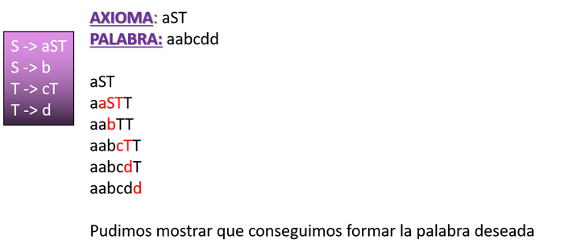

# Trabajo Práctico de Sintaxis y Semántica de los Lenguajes 

Trabajo Práctico de la asignatura Sintaxis y Semántica de los Lenguajes de la Universidad Tecnológica Nacional - FRBA.  
El mismo fue realizado con C en el IDE Dev-C++

Cargo  | Nombre
------------- | -------------
Docente | Oscar Bruno
Auxiliar | Roxana Leitux

## Información 📚

### Consigna
Crear, en lenguaje c, un micro compilador que logre demostrar el análisis sintáctico descendente recursivo de un archivo micro que se pasará como parámetro desde la consola.

### Introducción

Antes de comenzar a analizar dicho código, debemos tener en claro de donde parte el análisis. Por lo tanto explicaremos las etapas que conforman el análisis de un archivo y el concepto de derivación. 

- **Etapa de análisis:**  
El análisis de un código está conformado por tres etapas: el análisis léxico, el análisis semántico y análisis sintáctico.  
La primer parte es el análisis de la forma de escritura de cada línea del archivo. El mismo recibe caracteres y va analizando el lexema que se forma con los caracteres recibidos. Estos lexemas, son los que se analizan en la siguiente etapa.  
La segunda parte es el análisis sintáctico que es el estudio de las relaciones que guardan los lexemas entre sí y la identificación de las funciones de cada una de ellas en la oración. Como resultado, se crean los TOKENS, cadenas de caracteres que tiene un significado coherente en cierto lenguaje de programación.  
Estos TOKENS son los elementos analizados en la última parte, el análisis semántico. En esta parte se analiza el significado de cada uno de ellos dentro de una o más línea/s de código.  
  

- **Derivación:**  
Asumiendo que tenemos un lenguaje formado por una gramática formal, la derivación se conoce al análisis sintáctico de una palabra para corroborar si forma parte del lenguaje trabajado. El mismo se procesa paso a paso con distintas producciones, reemplazando los elementos no terminales del axioma para poder obtener la palabra. Para esto se conocen tres tipos de derivación, pero en este trabajo solamente trabajaremos con la izquierda la cual se comienza a reemplazar el primer elemento no terminal ubicado en la cadena, leyendo de  izquierda a derecha. Mostraremos un ejemplo:  
  

## Autores ✒️

* **Da Ruos, Ailen**
* **Obezzi, Matías**