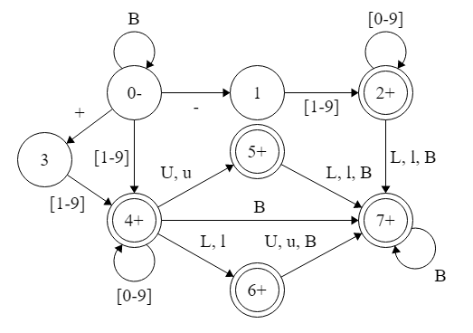
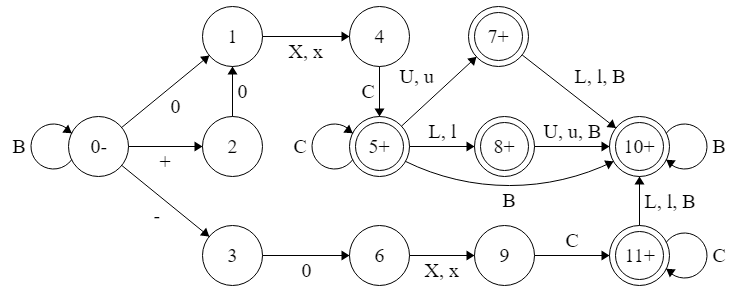
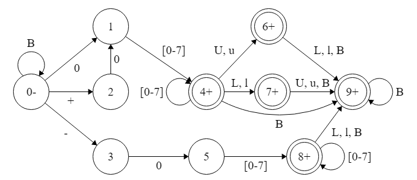
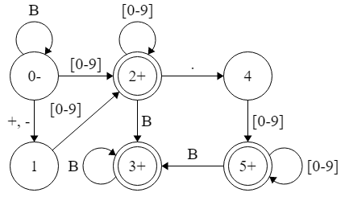
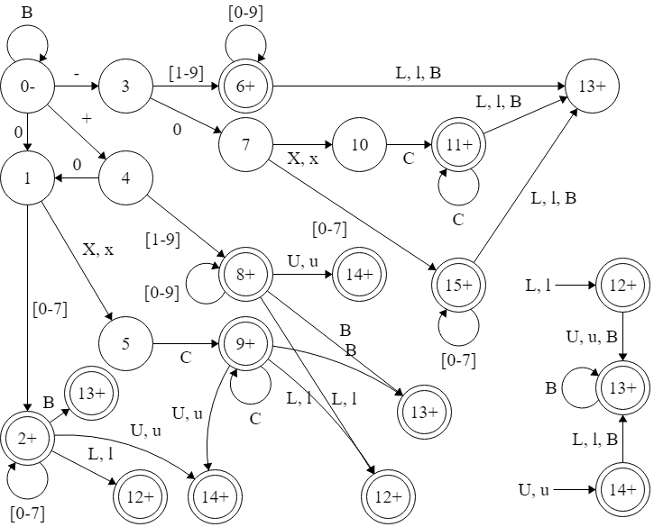
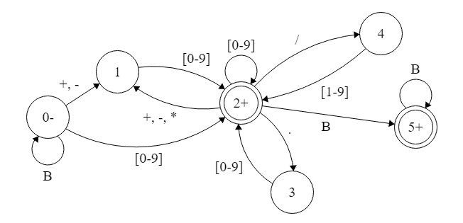

# Trabajo Práctico de Sintaxis y Semántica de los Lenguajes 

Trabajo Práctico de la asignatura Sintaxis y Semántica de los Lenguajes de la Universidad Tecnológica Nacional - FRBA. 
El mismo fue realizado con C en el IDE Dev-C++

Cargo  | Nombre
------------- | -------------
Docente | Oscar Bruno
Auxiliar | Roxana Leituz

## Información 📚

Contiene seis archivos programados en C:

* **[Reconocedor de Constante Entera Decimal](ReconocedorDecimal.c)**
  * Se trata de un programa en C que se encarga de detectar si una cadena ingresada es, o no, un número entero con, o sin, alguno de los subfijos u, ul, lu, l, U, Ul, UL, uL, L. En caso de q sea valida, mostrara el valor en decimal.
  * _Por ej: +245Ul_  
  
**_B = Espacio en blanco_** - **_L = l = Long_** - **_U = u = Unsigned_**

* **[Reconocedor de Constante Entera Hexadecimal](ReconocedorHexadecimal.c)**
  * Se trata de un programa en C que se encarga de detectar si una cadena ingresada es, o no, un número hexadecimal con, o sin, alguno de los subfijos u, ul, lu, l, U, Ul, UL, uL, L. En caso de q sea valida, mostrara el valor en decimal.  
  * _Por ej: -0xFd5l_  
  
**_B = Espacio en blanco_** - **_C= ([0-9], [a-f], [A-F])_** - **_L = l = Long_** - **_U = u = Unsigned_**

* **[Reconocedor de Constante Entera Octal](ReconocedorOctal.c)**
  * Se trata de un programa en C que se encarga de detectar si una cadena ingresada es, o no, un número octal con, o sin, alguno de los subfijos u, ul, lu, l, U, Ul, UL, uL, L. En caso de q sea valida, mostrara el valor en decimal.  
  * _Por ej: +0562ul_  
  
**_B = Espacio en blanco_** - **_L = l = Long_** - **_U = u = Unsigned_**

* **[Reconocedor de Flotante](ReconocedorFlotante.c)**
  * Se trata de un programa en C que se encarga de detectar si una cadena ingresada es, o no, una variable flotante. En caso de q sea valida, mostrara el valor en flotante.  
  * _Por ej: -254.2_  
  
**_B = Espacio en blanco_**  

* **[Reconocedor de Constantes Enteras (Decimal, Hexadecimal y Octal)](ReconocedorConstantes.c)**
  * Se trata de un programa en C que se encarga de detectar si una cadena ingresada es, o no, una constante descripta en la gramática del lenguaje C con, o sin, alguno de los subfijos u, ul, lu, l, U, Ul, UL, uL, L.  
  * _Por ej: +245Ul o -0xFd5l o +0562ul_  
  
**_B = Espacio en blanco_** - **_C= ([0-9], [a-f], [A-F])_** - **_L = l = Long_** - **_U = u = Unsigned_**

* **[Reconocedor de Expresión Aritmetica Simple (+ - * /)](ReconocedorExpresionAritmetica.c)**  
  * Se trata de un programa en C que se encarga de detectar si una cadena ingresada es, o no, una expresión arimética válida y retorna el valor de realizarla (en caso de que lo sea) en flotante.  
  * _Por ej: +340.8-40.8*10/3.4 = 220.8_  
  
**_B = Espacio en blanco_**  
  
_En todos los autómatas el Nodo 0 es el estado inicial_  
_En todos los autómatas los Nodos con doble borde son los estados finales_  

## Autores ✒️

* **Benitez, Carla**
* **Da Ruos, Ailen**
* **Obezzi, Matías**
