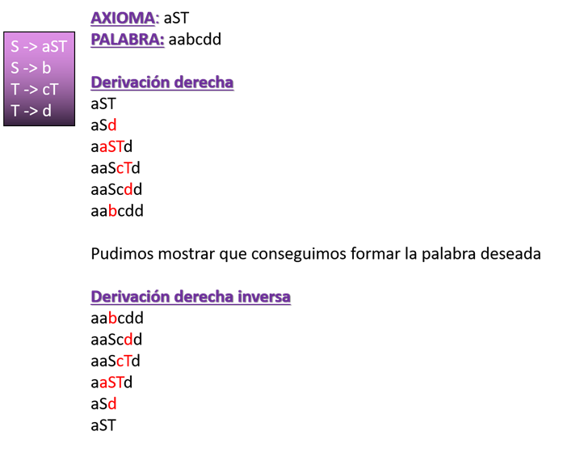

# Trabajo Práctico de Sintaxis y Semántica de los Lenguajes 

Trabajo Práctico de la asignatura Sintaxis y Semántica de los Lenguajes de la Universidad Tecnológica Nacional - FRBA.  

Cargo  | Nombre
------------- | -------------
Docente | Oscar Bruno
Auxiliar | Roxana Leituz

## Información 📚

### Consigna
Crear, mediante flex y bison, un micro compilador que logre demostrar el análisis sintáctico ascendente de un archivo micro que se pasará como parámetro desde la consola.

### Introducción

Se puede derivar de distintas maneras y, en este caso, corresponde utilizar la derivación derecha o derecha inversa. La primera se parte desde el axioma y se comienza a reemplazar el primer elemento no terminal ubicado en la cadena, leyendo de derecha a izquierda. En el caso de la inversa, es justamente el proceso inverso del anterior explicado. Por lo tanto, comenzamos con el resultado y terminaremos reemplazando combinaciones de elementos terminales que representan un elemento no terminal. Para corroborar que este bien, debe terminar con el axioma.  

- **Flex (Fast Lexical Analyzer):**  
Flex es una herramienta que permite generar analizadores léxicos (scanner) y el mismo genera código fuente en c, que mas tarde puede ser compilado. A partir de un conjunto de expresiones regulares, Flex busca concordancias en un fichero de entrada y ejecuta acciones asociadas a estas expresiones. El mismo está conformado por 3 secciones: Definiciones, Reglas y Código de usuario.  
Los analizadores Bison necesitan una función llamada yylex() para devolverles el siguiente token de la entrada. Esa función devuelve el tipo del próximo token y además puede poner cualquier valor asociado en la variable global yylval.  

- **Bison:**  
GNU bison es un programa generador de analizadores sintácticos (parser). El mismo convierte la descripción formal de un lenguaje, escrita como una gramática libre de contexto LALR, en un programa en C, C++, o Java que realiza análisis sintáctico. Es utilizado para crear analizadores para muchos lenguajes, desde simples calculadoras hasta lenguajes complejos. Para utilizar Bison, es necesaria experiencia con la sintaxis usada para describir gramáticas.  

### Proceso de Compilación:
1.	Escribir la especificación léxica en un fichero .l
2.	Escribir la especificación sintáctica en un fichero .y
3.	Compilar la especificación léxica con flex. El resultado de esto es un fichero lex.yy.c
4.	Compilar la especificación sintáctica con bison. El resultado de esto es un fichero asin.tab.c
5.	Compilar todo el código generado con el compilador de C. El resultado de esto es un fichero ejecutable a.out
6.	Ejecutar el analizador léxico-sintáctico obtenido 

### Líneas de comando:

1. **flex flex.l**  
La especificación léxica, flex.l, se compila con flex. Para poder lograrlo, se debe configurar las variables de entorno para permitirle a la compu reconocer el programa que compila.
2. **bison -d bison.y**  
La especificación sintáctica, bison.y, se compila con bison. Para poder lograrlo, se debe configurar las variables de entorno para permitirle a la compu reconocer el programa que compila.
3. **gcc -o ByF lex.yy.c bison.tab.c -lfl**  
En este caso, una vez obtenido el código de ambas partes, se compila todo para poder obtener el ejecutable.
4. **Ejecutar el .exe generado pasandole un archivo de micro como parametro**

## Autores ✒️

* **Da Ruos, Ailen**
* **Obezzi, Matías**